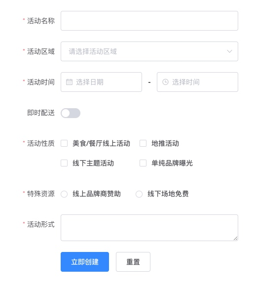

# 使用动态组件降低表单页面迭代成本

在开发pc后台管理项目时，表单页面占据了很大比例。如果是使用element组件库开发的项目，表单页面的模板中基本会有很多表单项的代码，如下：


```
<el-form :model="ruleForm" :rules="rules" ref="ruleForm" label-width="100px" class="demo-ruleForm">
  <el-form-item label="活动名称" prop="name">
    <el-input v-model="ruleForm.name"></el-input>
  </el-form-item>
  <el-form-item label="活动区域" prop="region">
    <el-select v-model="ruleForm.region" placeholder="请选择活动区域">
      <el-option label="区域一" value="shanghai"></el-option>
      <el-option label="区域二" value="beijing"></el-option>
    </el-select>
  </el-form-item>
  <el-form-item label="活动时间" required>
    <el-col :span="11">
      <el-form-item prop="date1">
        <el-date-picker type="date" placeholder="选择日期" v-model="ruleForm.date1" style="width: 100%;"></el-date-picker>
      </el-form-item>
    </el-col>
    <el-col class="line" :span="2">-</el-col>
    <el-col :span="11">
      <el-form-item prop="date2">
        <el-time-picker placeholder="选择时间" v-model="ruleForm.date2" style="width: 100%;"></el-time-picker>
      </el-form-item>
    </el-col>
  </el-form-item>
  <el-form-item label="即时配送" prop="delivery">
    <el-switch v-model="ruleForm.delivery"></el-switch>
  </el-form-item>
  <el-form-item label="活动性质" prop="type">
    <el-checkbox-group v-model="ruleForm.type">
      <el-checkbox label="美食/餐厅线上活动" name="type"></el-checkbox>
      <el-checkbox label="地推活动" name="type"></el-checkbox>
      <el-checkbox label="线下主题活动" name="type"></el-checkbox>
      <el-checkbox label="单纯品牌曝光" name="type"></el-checkbox>
    </el-checkbox-group>
  </el-form-item>
  <el-form-item label="特殊资源" prop="resource">
    <el-radio-group v-model="ruleForm.resource">
      <el-radio label="线上品牌商赞助"></el-radio>
      <el-radio label="线下场地免费"></el-radio>
    </el-radio-group>
  </el-form-item>
  <el-form-item label="活动形式" prop="desc">
    <el-input type="textarea" v-model="ruleForm.desc"></el-input>
  </el-form-item>
  <el-form-item>
    <el-button type="primary" @click="submitForm('ruleForm')">立即创建</el-button>
    <el-button @click="resetForm('ruleForm')">重置</el-button>
  </el-form-item>
</el-form>
```
当项目迭代时，随着需求的添加不断的添加更多的表单项或者隐藏部分表单项，这就给后期迭代带来了很多麻烦
1. 模板代码会越来越多
2. 使用v-if隐藏表单项让模板的代码更加冗余 

**针对这些问题我们将模板的表单代码拆分，用 " 表单对象 + 表单生成 " 来生成我们需要的表单**

* 表单对象：使用数组对象来描述整个表单的结构

```
//表单结构
let formList = [
  {
    attrs: {                 //formItem的attrs
      label: "活动区域",
      prop: "region"
    },
    listeners: {},          //formItem的listeners
    component: {
      name: 'el-input',        //动态组件component名字
      // value: '标签内容',
      attrs: {              //动态组件component的attrs
        type: "textarea",
        model: "region"
      },
      listeners: {},        //动态组件component的listeners
    },
  },
  {
    attrs: {                 //formItem的attrs
      label: "即时配送",
      prop: "delivery"
    },
    listeners: {},          //formItem的listeners
    component: {
      name: 'el-switch',        //动态组件component名字
      attrs: {              //动态组件component的attrs
        model: "delivery"
      },
      listeners: {},        //动态组件component的listeners
    },
  }
]
```
* 表单生成：使用 ” v-for + 动态组件 “ 生成整个表单

```
//表单生成组件
<template v-for="(itm,idx) in formList">
  <el-form-item label="活动名称"
    v-bind="itm.attrs"
    v-on="itm.listeners"
    v-if="hide"
    :key="idx"
    prop="name">
    <component :is="itm.comp.name"
      v-bind="itm.comp.attrs"
      v-on="itm.comp.listeners">{{itm.comp.value}}</component>
    <el-input v-model="ruleForm.name"></el-input>
  </el-form-item>
</template>
```
这样整个表单的生成就可以使用js来控制，在页面复用和版本迭代时就很有优势，举个🌰，我要把所有的表单置为只读readonly，只要使用数组foreach遍历表单数组对象，给所有子项添加readonly属性就可以，避免在模板写一堆的v-if去做控制
当然这样子处理还是会有一定的限制，例如slot的东西需要特别处理，我上面写的只是普通场景就够用了，如果要支持更多场景需要再进行处理


