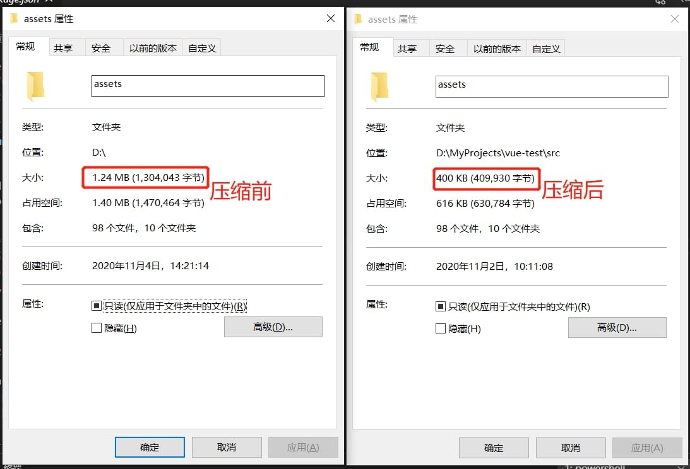

# 项目图片加载优化
## 项目图片加载的场景
在项目开发中经常有处理图片的场景，即使我们在上传的时候已经对图片进行了压缩，但是我们在实际用到的时候还是不够，举个🌰


头像、商品图片、活动图片都有存在这些场景，就是我们上传的图片大小比实际用的时候要大。在这种情况下，我们页面的元素实际上只有70 x 70像素，但是我们下载回来的图片却是1000 x 10000和751 x 531,即便是在移动端中的高分屏也浪费了很多资源。为了应对不同场景下的图片的加载，我们可以基于阿里云图片缩放来做优化。

## 解决方案

### 阿里云图片缩放服务

示例：原图大小为200 px*100 px，缩放参数为w=150 px，h=80 px。则不同的缩略模式，得到的缩放图如下：

* fill
* fill参数会先将图片等比缩放为延伸出指定w与h的矩形框外的最小图片，之后按照固定宽高进行裁剪。即先将原图缩放为160 px*80 px，之后将w居中裁剪为150 px，得到大小为150 px*80 px的缩放图。


**举个🌰这张实例图大小为400\*267像素**


* 固定宽高，自动裁剪
* 需求及处理参数如下：
* 将原图缩放成宽高100 px：resize,h_100,w_100
* 缩放模式fill：m_fill
图片处理的URL为：http://image-demo.oss-cn-hangzhou.aliyuncs.com/example.jpg?x-oss-process=image/resize,m_fill,h_100,w_100


缩放后为大小100\*100像素

### 第一种方案：开发者控制加载图片的大小
我们在项目开发的时候可以事先封装好图片处理的工具函数，由开发者自己按需求决定如何缩放图片
```
/**
 * @description: 图片加工，按照模式和参数拼接到图片地址后面
 * @param {String} mode 模式 
 * @param {Object} options 图片参数 
 * @return {String} 图片地址
 */
function handleImg (mode, options) {
  const { src, width, height } = options
  return `${src}?x-oss-process=image/resize,m_${mode},h_${height},w_${width}`
}
```
优点：
1. 实现简单，效果准确
2. 图片加工函数可以在使用阿里云服务的项目中复用

缺点：
1. 增加开发成本和迭代成本，一旦项目需求有变，我们需要修改的地方更多。
2. 已开发引入成本太高，在现有的项目中无法简便的推广下来。


### 第二种方案：组件


```
<template>
  
</template>

<script>
export default {
  props: {
    src: {
      default: '',
      type: String
    }
  },
  methods: {
    /**
     * @description: 图片加工，按照模式和参数拼接到图片地址后面
     * @param {String} mode 模式 
     * @param {Object} options 图片参数 
     * @return {String} 图片地址
     */
    handleImg (mode, options) {
      const { src, width, height } = options
      return `${src}?x-oss-process=image/resize,m_${mode},h_${height},w_${width}`
    },
    imgLoad (el) {
      //获取图片元素，第一个元素就是我们实际的img
      let img = el.path[0];
      //这一步是防止imgLoad函数被重复调用，所以判断当前的图片地址是否是
      //占位图片的地址，如果不是则结束运行
      //这里要注意，如果项目中有配置小于8k的图片转为base64,这里就不能以“loading.svg”去判断是否是占位图，
      if (img.currentSrc.indexOf('loading') === -1) {
        return;
      }
      //图片实际的占用的像素大小（图片实际宽高）
      let { clientHeight: height, clientWidth: width } = img;
      let src = null;
      //判断图片资源是否已经是阿里云图片
      if (this.src.indexOf('aliyuncs.com') === -1) {
        src = this.src;
      } else {
        src = img.dataset.src.split('?')[0] + handleImg('fill', { src: this.src, height, width })
      }
      img.setAttribute('src', src);
    },
  },
};
</script>

<style scoped >
.Img {
  max-width: 100%;
  max-height: 100%;
}
</style>
```
### 使用：


### 效果：

处理前：


处理后：


这里参考了一下图片懒加载的知识，把实际图片的地址赋值给data-src,在图片加载的时候，利用一个小技巧，先让img加载一张预占位的loading图来获取到实际img元素的实际的宽高，然后在img元素图片加载完的回调函数onload中将原来图片地址➕img元素实际宽高再赋值给img元素的src完成图片加载。

优点：

1. 方便，不用开发者自己手动控制图片大小，需求变动下有优势
2. 复用，可根据实际项目情况进行修改复用或者直接使用
3. 应用简单，在旧的项目中把img改为Img就可以了
4. 方便有一个集中的入口对图片进行优化，如果后续有新的优化也可在这里优化

缺点：
1. 覆盖的场景不够全面，在我自测中该方法对图片元素实际的宽高自动判断还不够好，判断的范围取决于预占图的大小，所以无法覆盖所有使用的场景。
2. 应该还有其他缺点我没想到


## 项目图片资源压缩
常用的方法有两种：
1. 手动压缩后放到项目中，优点是一次压缩，终身受益，缺点是图片一多手动的时间成本就很高，而且压缩与否取决于开发者的决定，一旦开发流程紧张，常常不被引起注意，而且这种细节的东西经常是静态资源太多了，开发者才会去注意这些问题，得到的关注不高。总结就是：不省心、省事

2. webpack配置在打包的时候进行压缩，优点是省事，配置好webpack的配置就可以了，以后就算有新图片资源加入，开发者不用再操心。但是每次打包都需要压缩图片，重复压缩浪费资源，在图片资源一多的情况下打包的时间直线上升，会增加布版的时间

以上方法都不够好，我们需要的方案是 一次压缩 + 自动 

这里推荐的方法是在每次我们添加了静态资源后，在提交commit前对图片资源进行压缩，这样既可以覆盖所有的图片，同时满足一次压缩 + 自动 的期望。

具体使用了插件：

 * husky：Git hooks 工具，支持在git操作的钩子函数添加我们自定义的处理
 * lint-staged：git暂存文件上运行linters的工具，方便筛选出图片支援
 * imagemin-linter：图片压缩插件

### 具体步骤

 1. 安装依赖

```
npm i -D husky lint-staged imagemin-linter
```

2. 在package.json加入以下配置

```
  "husky": {
    "hooks": {
      "pre-commit": "lint-staged"
    }
  },
  "lint-staged": {
    "*.{png,jpeg,jpg,gif,svg}": "imagemin-linter"
  },
```

### 使用：


### 效果：

以铁骑小程序项目的静态资源为例：


